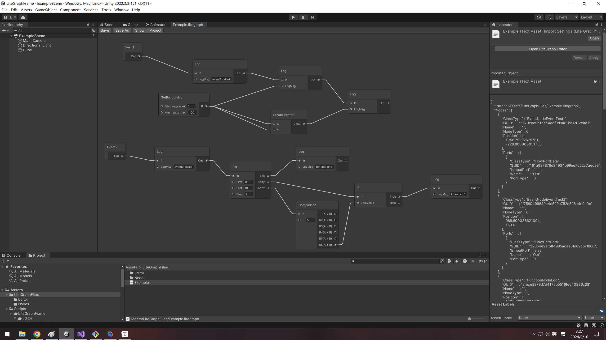

# Lite Graph Frame

## 一、项目介绍

一套可视化编辑逻辑框架，通过增加节点、节点间连线实现游戏逻辑，功能类似UE的Blueprint。

项目源码使用C#编写，图形界面使用Unity接口实现，除图形界面外的功能不依赖于Unity环境，即在Unity编辑器中生成一份文件后，在客户端或服务端通过C#在运行时解析并执行。

框架优点：

- 使用简单，安装无需复杂操作，项目自定义节点添加简单，源码易读易修改。
- 双端通用，运行时不依赖Unity环境。

## 二、使用方法

### （一）示例项目

下载项目后直接作为Unity项目打开，在Unity编辑器Project面板中打开Asset/LiteGraphFiles/Example.litegraph样例文件，修改后点击左上角"Save"按钮保存，运行项目后检查运行时效果。



### （二）正常接入

1.拷贝Asset/Scripts/LiteGraphFrame文件夹到项目代码中，修改LiteGraphFrame/Editor/Config.cs的两个配置路径，指定自定义节点和内置节点的代码生成存放路径。

2.点击Tools/Lite Graph Frame/Code Generate，会根据上一步的配置路径在指定路径生成节点代码。

3.Unity编辑器Project面板中右键"Create/Lite Graph File"创建一份litegraph文件，双击打开litegraph可以进行编辑。

4.[项目自定义节点拓展。](#node-extension)

5.打开任一litegraph文件编辑内容，右键选择"Create Node"创建节点，连线节点之间的端口控制流程和数据输入，编辑完成后点击"Save"按钮保存文件。

6.运行时测试，代码可以参考"Asset/RunLiteGraphExample.cs"。

```c#
void Start()
{
    // 只需初始化一次
    LiteGraphNodeFactory.InitCustomFactory();

    // 运行时测试
    int eventId = 1; // EventNodeEventTest1.GetEventId()的返回值
    LiteGraphRuntimeUtil.RunLiteGrpah("Assets/LiteGraphFiles/Example.litegraph", eventId);
    eventId = 2; // EventNodeEventTest2.GetEventId()的返回值
    LiteGraphRuntimeUtil.RunLiteGrpah("Assets/LiteGraphFiles/Example.litegraph", eventId);
}
```

### （三）名词说明

1.节点

- 事件节点：入口节点，通过流程端口连接其他功能节点，需要为每个事件节点设置唯一的事件ID，在代码中埋点调用。
- 数据节点：获取、构建某些数据，并通过数据端口传递给功能节点。
- 功能节点：具体功能的实现，通过数据端口接收数据节点传递的数据，根据数据实现某些逻辑，功能节点之间以流程端口连接。
- 自定义节点：各项目根据需求定制化的节点，包括事件节点、数据节点、功能节点。
- 内置节点：各项目通用的节点，例如For循环、If等流程控制功能，And、Or等逻辑判断功能。

2.端口

- 流程端口：负责节点的运行顺序控制。
- 数据端口：负责节点间的数据传递。

3.litegraph文件

- 把节点、端口、端口间连线等内容序列化存储得到一份json格式文件，运行时反序列化重新构建节点结构。
- 一般以模块划分文件，例如skill1001.litegraph、skill1002.litegraph、skill1003.litegraph，buff001.litegraph、buff002.litegraph。

### <a name="node-extension">（四）节点拓展 </a>

1.自定义节点拓展

①进行节点声明，参考LiteGraphFiles/Editor/Nodes里的各种节点。

②点击Tools/Lite Graph Frame/Code Generate生成节点代码。

③进行节点功能实现，参考LiteGraphFiles/Nodes里的各种节点。

2.内置节点拓展

①进行节点声明，需继承IBuiltinNode接口，参考LiteGraphFrame/Editor/Nodes里的各种节点。

②点击Tools/Lite Graph Frame/Code Generate生成节点代码。

③进行节点功能实现，参考LiteGraphFrame/Runtime/Nodes里的各种节点。

## 三、源码实现

1.图形接口使用Unity的GraphView实现，部分界面代码参考Shader Graph实现，界面代码都在LiteGraphFrame/Editor/Drawing中。

2.序列化和反序列化使用LitJson库，只使用了基础的JsonData和string相互转化，未使用序列化对象功能。

3.使用代码生成，替代运行时使用反射创建类实例、给字段赋值。

### 四、未来计划

1.sub graph、注释节点、group、动态端口等功能支持。

2.界面功能补充。
